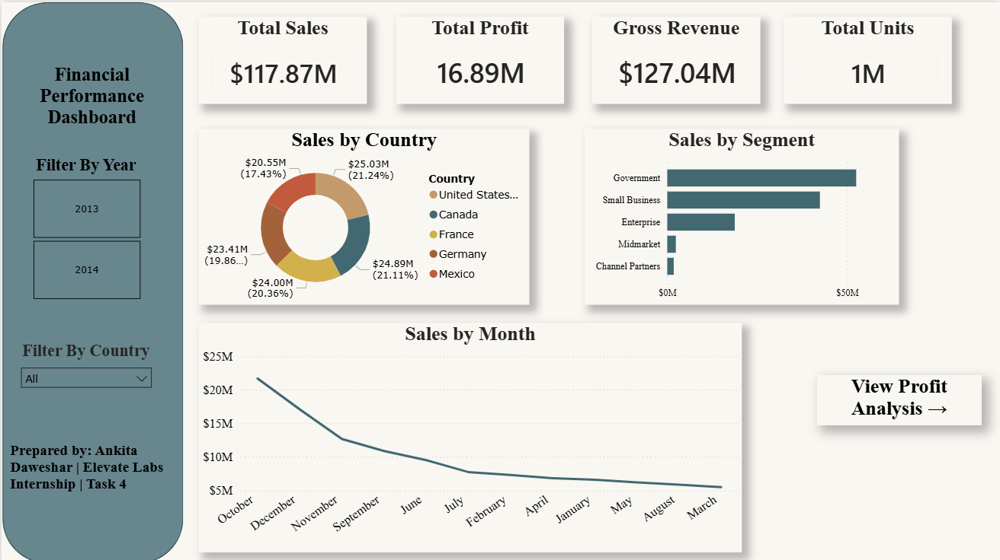
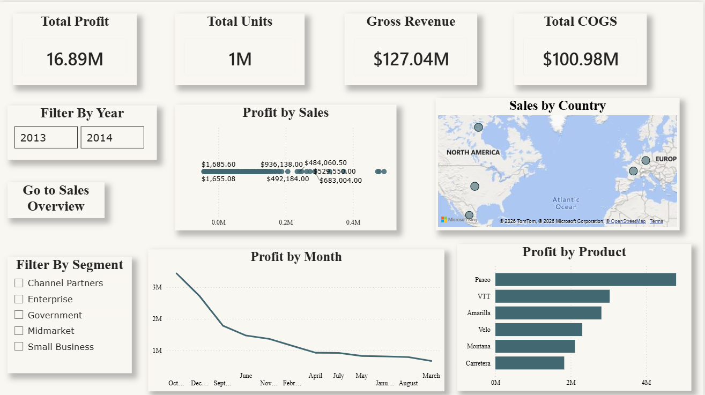

# Task 4: Financial Performance Dashboard Design

## 💼 Elevate Labs Data Analyst Internship
**Intern:** Ankita Daweshar  
**Date:** June 2026  
**Tool Used:** Power BI Desktop (DAX, Power Query Editor)  
**Dataset:** Verified Global Financial Sample Dataset (Kaggle)

---

## 📌 Executive Objective
The core objective of this project is to design, model, and deploy an interactive, production-grade two-page Business Intelligence dashboard. The solution translates complex transactional data across global markets into structured, actionable financial insights—empowering executive stakeholders to track gross-to-net sales velocity, monitor profitability leakage, optimize product portfolio structures, and make strategic data-driven decisions.

---

## 📸 Dashboard Preview

### Page 1 — Sales Overview Dashboard
*Comprehensive high-level tracking of global revenue, market segment drivers, and performance seasonality.*

### Page 2 — Profit Analysis Dashboard
*Granular diagnostic view exploring product cost parameters, absolute profitability margins, and geographical distribution.*

---

## 📂 Dataset Architecture & Specifications
- **Data Source:** Kaggle Financial Sample Dataset
- **Volume & Structure:** 700 structured records × 16 operational attributes (referenced via `Financials.csv`)
- **Key Fields Investigated:** Segment, Country, Product, Units Sold, Manufacturing Price, Sale Price, Gross Sales, Discounts, Net Sales, COGS, Profit, and multi-tier Date dimensions.

---

## 📊 Core Business Intelligence Layout

### Page 1 — Sales Overview (`Sales_overview.png`)
| Visual Component | Operational Metric / Business Purpose |
| :--- | :--- |
| **Executive KPI Cards** | High-level summary displaying **Total Sales ($117.87M)**, **Total Profit ($16.89M)**, **Gross Revenue ($127.04M)**, and **Total Units Sold (1M)**. |
| **Donut Chart** | **Sales by Country** — Visualizing geographic revenue distribution (Led by USA at **$25.03M** / 21.24%). |
| **Horizontal Bar Chart** | **Sales by Segment** — Measuring consumer-vertical volume (Led by Government at **$52.50M**). |
| **Temporal Line Chart** | **Sales by Month** — Exposing structural seasonal cycles across fiscal periods. |
| **Dynamic Slicers** | Interactive global filtering parameters for **Year** (2013/2014) and **Country**. |

### Page 2 — Profit Analysis (`Profit_analysis.png`)
| Visual Component | Operational Metric / Business Purpose |
| :--- | :--- |
| **Executive KPI Cards** | Margin summary tracking **Total Profit ($16.89M)**, **Total Units (1M)**, **Gross Revenue ($127.04M)**, and **Total COGS ($100.98M)**. |
| **Horizontal Bar Chart** | **Profit by Product** — Ranking absolute product-line margin generation (Led by Paseo at **$4.80M**). |
| **Scatter Plot** | **Profit by Sales** — Diagnostic clustering mapping correlation between volume velocity and profit. |
| **Temporal Line Chart** | **Profit by Month** — Dissecting net earnings over operational timelines to observe margin trends. |
| **OpenStreetMap Visual** | **Sales by Country** — Interactive spatial mapping showing global performance hubs. |
| **Dynamic Slicers** | Interactive global filtering parameters for **Year** and **Business Segment**. |

---

## 💡 Key Data-Driven Insights
* **Public Sector Dominance:** The **Government** segment acts as the foundational revenue and margin driver, securing a dominant **44.5% share** of all enterprise sales ($52.50M total gross sales).
* **Core Product Leader:** **Paseo** proves to be the portfolio's anchor product line, contributing **$4.80M** in pure net profitability, while *Carretera* lags substantially at the bottom.
* **Pronounced Q4 Seasonality:** Operational cash flows and transactions are heavily subject to quarter-end purchase cycles, with huge volume peaks concentrated across **October ($20.55M sales)** and **December ($19.34M sales)**.
* **North American Revenue Concentration:** Regional cluster analysis indicates that the North American market corridor (**USA + Canada**) anchors the corporate footprint, contributing an aggregate **$49.92M** in net sales.
* **Healthy Profit-to-Sales Velocity:** The enterprise maintains an overall healthy profit-to-sales ratio of **14.2%** against global net sales, though pulled down selectively by losses in the *Enterprise* segment.

---

## 🎨 User-Centric Design System
* **Bespoke Executive Layout:** Utilizes a highly structured, minimalist workspace theme featuring clear typographic headers, clear container card borders, and high contrast against crisp white grids for max accessibility.
* **Seamless Dashboard Navigation:** Programmed with dedicated canvas action buttons (`Go to Sales Overview` and `View Profit Analysis →`) ensuring seamless, intuitive transitions for boardroom presentations.
* **Optimized Information Density:** Tailored with a strict hierarchy layout placing macro KPI scorecards at the top, moving down to comparative charts, and anchoring into complex temporal charts.

---

## 📁 Repository Map & Inventory
| File Name | Structural Purpose & Format Type |
| :--- | :--- |
| 📊 `Financial_Dashboard.pbix` | Master Power BI Desktop file containing data models, DAX measures, and presentation layer. |
| 📄 `Financial_Dashboard.pdf` | High-resolution static presentation printout of the finalized two-page analytical view. |
| 🗂️ `Financial_Dashboard_Summary..pptx` | Executive-ready stakeholder slideshow supporting business reviews. |
| 🪟 `Sales_overview.png` | Production capture of Page 1: Sales Performance Architecture. |
| 🪟 `Profit_analysis.png` | Production capture of Page 2: Cost, Margin, and Profit Diagnostics. |
| 🔢 `Financials.csv` | Raw foundational Kaggle CSV dataset containing the 700 operational logs. |

---

## 🛠️ Technology Stack
* **Power BI Desktop:** Core application engine for semantic layout creation and dashboard compilation.
* **Power Query Editor:** Executed complete ETL pipeline (Data extraction, transformation, structural column normalization, and whitespace cleanup).
* **DAX (Data Analysis Expressions):** Programmed to build robust calculations, aggregations, and context-aware KPIs.
* **Microsoft PowerPoint:** Layout framework used for compiling the final project summary deck.
